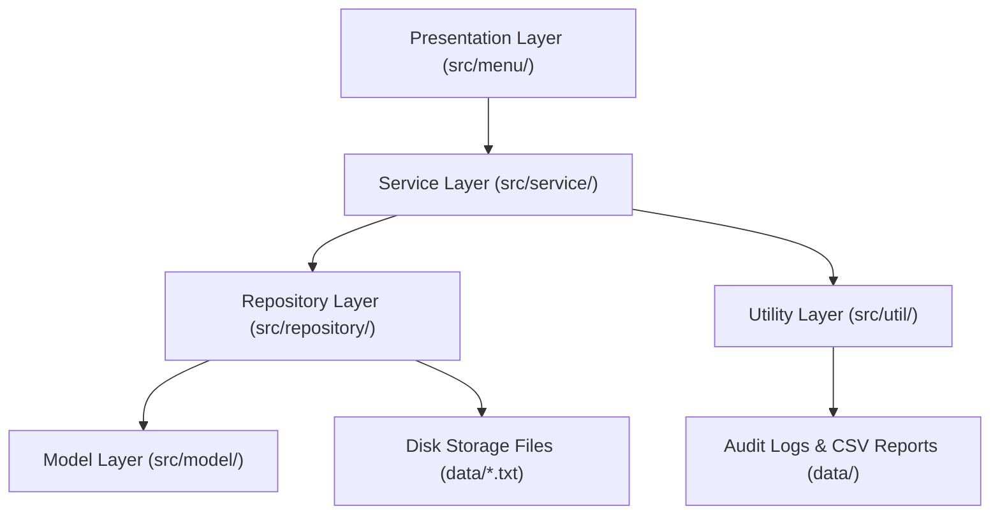

# 📘 TalentFlow ATS - Technical Documentation & Concepts Mapping

---

## 📄 Executive Summary

**TalentFlow** is a college-viva-ready, enterprise-grade Recruitment & Applicant Tracking System (ATS) written entirely in **Pure Core Java 21**. It operates without any external frameworks (No Spring Boot, JavaFX, Swing, Maven, or Gradle) and features a clean **Layered Architecture**, dynamic **Max-ID Auto-Incrementing**, **Permanent Disk Storage Persistence**, and **Role-Based Access Control (RBAC)**.

---

## 🏛️ System Architecture

The application follows a standard **Layered (N-Tier) Architecture** to ensure high cohesion and loose coupling:



---

## 📚 Complete File & Concept Mapping

### 1. 🏗️ Model Layer (`src/model/`)

#### 📄 [User.java](file:///c:/Users/sudar/OneDrive/Documents/talentFlow/src/model/User.java)
- **Abstraction:** Declared as an `abstract class User` representing the baseline template for system actors. Cannot be instantiated directly.
- **Abstract Method:** Defines `public abstract void displayDetails()` forcing child classes to implement tailored display formats.
- **Encapsulation:** Private attributes (`id`, `name`, `email`, `phone`, `password`) accessed strictly via getters and setters.
- **Constructor Overloading:** Provides default and parameterized constructors.

#### 📄 [Candidate.java](file:///c:/Users/sudar/OneDrive/Documents/talentFlow/src/model/Candidate.java)
- **Inheritance (`extends`):** Extends `User`, inheriting core profile fields (`id`, `name`, `email`, `phone`, `password`).
- **Polymorphism (Method Overriding):** Overrides `displayDetails()` with `@Override` to print candidate-specific details (`skill`, `experience`, `status`, `resumeSummary`). Overrides `toString()`.
- **Encapsulation:** Protects domain attributes (`skill`, `experience`, `status`, `resumeSummary`) behind private modifiers.

#### 📄 [Recruiter.java](file:///c:/Users/sudar/OneDrive/Documents/talentFlow/src/model/Recruiter.java)
- **Inheritance (`extends`):** Extends `User` to share common user properties.
- **Polymorphism (Method Overriding):** Overrides `displayDetails()` to print recruiter-specific information (`company`). Overrides `toString()`.
- **Encapsulation:** Encapsulates the `company` field with public getters/setters.

#### 📄 [Job.java](file:///c:/Users/sudar/OneDrive/Documents/talentFlow/src/model/Job.java)
- **Encapsulation:** Manages private attributes (`jobId`, `title`, `company`, `location`, `salaryRange`, `requiredSkill`).
- **Constructor Overloading:** Provides overloaded constructors to handle default vs custom salary ranges.
- **Console Presentation:** Method `displayJob()` formats job postings into structured ASCII console blocks.

#### 📄 [Application.java](file:///c:/Users/sudar/OneDrive/Documents/talentFlow/src/model/Application.java)
- **Relationship Model:** Represents candidate job applications linking `candidateId` and `jobId` alongside `status` tracking (`Applied`, `Interview`, `Selected`, `Rejected`, `Withdrawn`).

---

### 2. 🗄️ Repository Layer (`src/repository/`)

#### 📄 [CandidateRepository.java](file:///c:/Users/sudar/OneDrive/Documents/talentFlow/src/repository/CandidateRepository.java)
- **Repository / DAO Pattern:** Abstracts data access operations from business logic.
- **In-Memory Collection:** Uses `private static final ArrayList<Candidate>` for runtime operations.
- **Static Initializer (`static {}`):** Executes automatically at class load time to load disk records from `data/candidates.txt`.
- **Dynamic Max-ID Algorithm:** Method `getNextId()` scans all Candidate IDs and assigns `max(ID) + 1` (starting at 501), ensuring 100% ID uniqueness without duplicates.
- **Data Integrity:** Method `isEmailExists(String email)` checks for duplicate emails before registration.

#### 📄 [RecruiterRepository.java](file:///c:/Users/sudar/OneDrive/Documents/talentFlow/src/repository/RecruiterRepository.java)
- **Static Persistence:** Loads records from `data/recruiters.txt` inside `static {}`.
- **Dynamic Max-ID Algorithm:** Method `getNextId()` dynamically returns `max(ID) + 1` (starting at 1).
- **Email Uniqueness:** Enforces unique recruiter email addresses.

#### 📄 [JobRepository.java](file:///c:/Users/sudar/OneDrive/Documents/talentFlow/src/repository/JobRepository.java)
- **Static Storage & Disk Sync:** Reads from and writes to `data/jobs.txt`.
- **Dynamic Max-ID Algorithm:** Method `getNextId()` calculates `max(JobId) + 1` (starting at 101).

#### 📄 [ApplicationRepository.java](file:///c:/Users/sudar/OneDrive/Documents/talentFlow/src/repository/ApplicationRepository.java)
- **Dynamic Max-ID Algorithm:** Method `getNextId()` assigns `max(ApplicationId) + 1` (starting at 1001).
- **Cascade Deletion Integrity:**
  - `deleteApplicationsByCandidateId(int candidateId)`: Purges applications when a candidate is deleted.
  - `deleteApplicationsByJobId(int jobId)`: Purges applications when a job opening is deleted.

---

### 3. ⚙️ Service Layer (`src/service/`)

#### 📄 [CandidateService.java](file:///c:/Users/sudar/OneDrive/Documents/talentFlow/src/service/CandidateService.java)
- **Business Logic Layer:** Coordinates candidate actions between UI and repository.
- **Polymorphism (Method Overloading):**
  - `searchCandidate(int id)`: Searches candidate by integer ID.
  - `searchCandidate(String name)`: Searches candidates by name keyword.
- **Cascade Coordination:** Method `deleteCandidate(int id)` removes candidate records and triggers cascade deletion of their applications.

#### 📄 [RecruiterService.java](file:///c:/Users/sudar/OneDrive/Documents/talentFlow/src/service/RecruiterService.java)
- **Authentication Engine:** Method `authenticateRecruiter(int id, String password)` verifies recruiter credentials.
- **StringBuilder Optimization:** Constructs ASCII tables using `StringBuilder` to minimize heap memory allocation.

#### 📄 [JobService.java](file:///c:/Users/sudar/OneDrive/Documents/talentFlow/src/service/JobService.java)
- **Privacy Filtering:** Method `viewJobs()` hides the `REQUIRED SKILL` column in candidate public view to prevent applicants from gaming matching criteria.
- **Method Overloading:** Supports `searchJob(int id)` and `searchJob(String title)`.

#### 📄 [ApplicationService.java](file:///c:/Users/sudar/OneDrive/Documents/talentFlow/src/service/ApplicationService.java)
- **Automated Skill Matching Engine:** Compares candidate skills against job requirements using `String.contains()`, auto-assigning matching candidates to open positions.
- **Dual-Interface View:** Separate views for Candidate Portal (`viewApplicationsForCandidate`) and Recruiter Portal (`viewApplicationsForRecruiter`).
- **State Machine Workflow:** Governs status transitions (`Applied` ➡️ `Interview` ➡️ `Selected` / `Rejected` / `Withdrawn`).

---

### 4. 🛠️ Utility Layer (`src/util/`)

#### 📄 [Validation.java](file:///c:/Users/sudar/OneDrive/Documents/talentFlow/src/util/Validation.java)
- **Utility Pattern:** Provides static helper methods for validation.
- **Regular Expressions (Regex):**
  - `isValidEmail()`: Domain format check (`^[A-Za-z0-9._%+-]+@[A-Za-z0-9.-]+\\.(com|net|org|edu|in|co)$`).
  - `isValidPhone()`: 10-digit Indian phone prefix check (`^[6-9][0-9]{9}$`).
  - `isValidPassword()`: Complex password check (`^(?=.*[a-z])(?=.*[A-Z])(?=.*[0-9])(?=.*[!@#$%^&*]).{8,}$`).

#### 📄 [FileManager.java](file:///c:/Users/sudar/OneDrive/Documents/talentFlow/src/util/FileManager.java)
- **File I/O Streams:** Uses `FileWriter`, `BufferedWriter`, `FileReader`, and `BufferedReader`.
- **Custom Serialization:** Serializes objects into pipe-delimited text (`|`) in `data/` and deserializes them on startup.
- **Audit File Logging:** Writes timestamped logs to `data/logs.txt`.
- **HR CSV Exporter:** Generates `data/ats_export_report.csv` for Excel analytics.

---

### 5. 🖥️ Presentation Layer (`src/menu/`)

#### 📄 [Menu.java](file:///c:/Users/sudar/OneDrive/Documents/talentFlow/src/menu/Menu.java)
- **4-Portal Role-Based Architecture:** Top-level controller managing 4 distinct sub-systems:
  1. **Admin Portal** (Password: `admin_1234`)
  2. **Recruiter Portal** (Password: `Sarnine@123`)
  3. **Candidate Portal** (Candidate ID + Password)
  4. **Apply / Register as New Candidate**
- **Robust Exception Handling:** Catches `InputMismatchException`, `NullPointerException`, and `IllegalArgumentException` in user input loops.

#### 📄 [Main.java](file:///c:/Users/sudar/OneDrive/Documents/talentFlow/src/menu/Main.java)
- **Application Entry Point:** Contains `public static void main(String[] args)` launching `Menu`.

---

## 📊 Summary Concept Table

| Java Concept / Principle | Target File(s) | Implementation Purpose |
| :--- | :--- | :--- |
| **Abstraction** | [User.java](file:///c:/Users/sudar/OneDrive/Documents/talentFlow/src/model/User.java) | Abstract base class defining common template & abstract method `displayDetails()`. |
| **Inheritance** | [Candidate.java](file:///c:/Users/sudar/OneDrive/Documents/talentFlow/src/model/Candidate.java), [Recruiter.java](file:///c:/Users/sudar/OneDrive/Documents/talentFlow/src/model/Recruiter.java) | Child classes inheriting common fields from `User`. |
| **Encapsulation** | All Model Classes (`src/model/`) | Private attributes accessed via public getters and setters. |
| **Polymorphism (Overriding)**| `Candidate`, `Recruiter` | Overriding `displayDetails()` and `toString()`. |
| **Polymorphism (Overloading)**| `CandidateService`, `JobService` | Overloading `searchCandidate(int/String)` and `searchJob(int/String)`. |
| **Static Initializer (`static {}`)** | All Repositories (`src/repository/`) | Reading disk files into memory automatically on startup. |
| **File I/O Streams** | [FileManager.java](file:///c:/Users/sudar/OneDrive/Documents/talentFlow/src/util/FileManager.java) | Permanent disk storage (`BufferedWriter`/`BufferedReader`) & CSV Export. |
| **Regular Expressions (Regex)**| [Validation.java](file:///c:/Users/sudar/OneDrive/Documents/talentFlow/src/util/Validation.java) | Enforcing 8+ char password rules, 10-digit 6-9 phone prefixes, and strict emails. |
| **Exception Handling** | [Menu.java](file:///c:/Users/sudar/OneDrive/Documents/talentFlow/src/menu/Menu.java) | Catching `InputMismatchException` to prevent application crashes on invalid input. |
| **Role-Based Access Control**| `Menu.java` | Password guarding for Admin (`admin_1234`), Recruiters (`Sarnine@123`), and Candidates. |

---

## 💻 How to Compile & Run

```powershell
cd c:\Users\sudar\OneDrive\Documents\talentFlow
javac -d bin src/model/*.java src/repository/*.java src/util/*.java src/service/*.java src/menu/*.java
java -cp bin menu.Main
```
